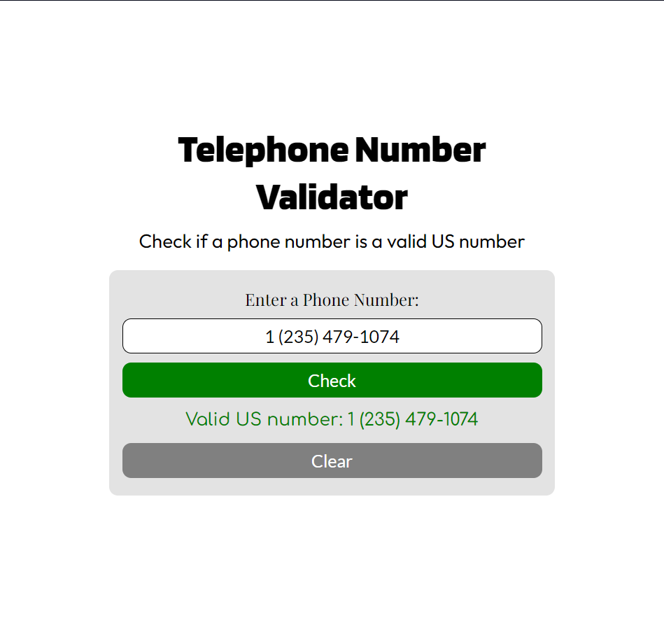

# Telephone Number Validator
 A simple program page that checks if a given number is a valid US telephone number, made for FreeCodeCamp certification Project using HTML, CSS and JavaScript

 You only need a browser to view and use this program, open the index.html file.

## Valid formats for US number
```
1 555-555-5555
1 (555) 555-5555
1(555)555-5555
1 555 555 5555
5555555555
555-555-5555
(555)555-5555
```
 this App supports the above formats, other formats may not be supported.

 
## Page Preview
 
